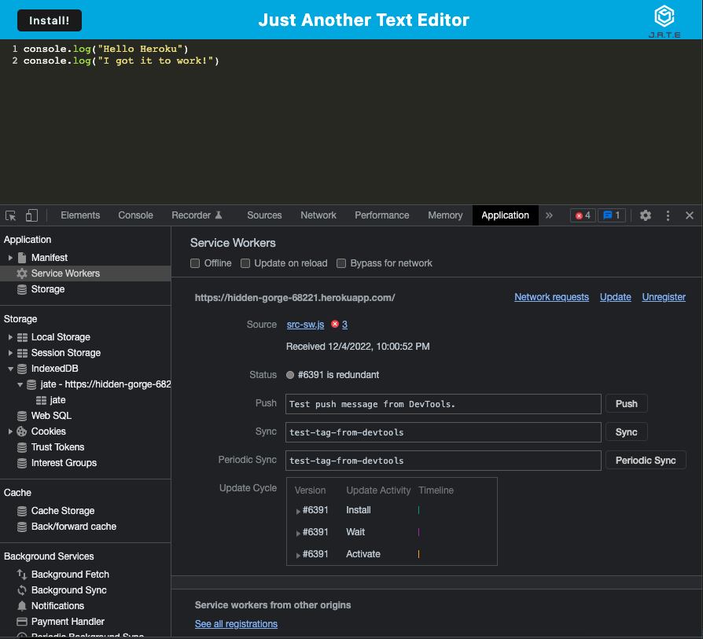

# PWA Text Editor

[](https://opensource.org/licenses/MIT)

 **Visit the [Deployed Site here.](https://hidden-gorge-68221.herokuapp.com/)**

  **Deployment Date:**  12/04/22 <br>
 
  **Technologies used:** Node.js, JavaScript, WebPack<br>

  **Project goal:** Add to existing code to create a text editor that runs in the browser and meets PWA criteria. <br>


  ## Table of Contents
  1. [Project Description](#Description)
  2. [Installation](#Installation)
  3. [Challenges Encounted](#Challenges)
  4. [Future Development](#Future-Development)
  5. [Tests](#Tests)
  6. [License](#License)
  <br>
  
  ## Description
   The goal of this project was to add pertinent code to an existing text editor to make it a PWA. The text editor was already functional, but needed to be updated to meet PWA criteria. The provided criteria included:

## Acceptance Criteria

```
GIVEN a text editor web application
WHEN I open my application in my editor
THEN I should see a client server folder structure
WHEN I run `npm run start` from the root directory
THEN I find that my application should start up the backend and serve the client
WHEN I run the text editor application from my terminal
THEN I find that my JavaScript files have been bundled using webpack
WHEN I run my webpack plugins
THEN I find that I have a generated HTML file, service worker, and a manifest file
WHEN I use next-gen JavaScript in my application
THEN I find that the text editor still functions in the browser without errors
WHEN I open the text editor
THEN I find that IndexedDB has immediately created a database storage
WHEN I enter content and subsequently click off of the DOM window
THEN I find that the content in the text editor has been saved with IndexedDB
WHEN I reopen the text editor after closing it
THEN I find that the content in the text editor has been retrieved from our IndexedDB
WHEN I click on the Install button
THEN I download my web application as an icon on my desktop
WHEN I load my web application
THEN I should have a registered service worker using workbox
WHEN I register a service worker
THEN I should have my static assets pre cached upon loading along with subsequent pages and static assets
WHEN I deploy to Heroku
THEN I should have proper build scripts for a webpack application
```

## Installation
run ```npm i``` to install dependencies
To deploy the application locally run ```npm start``` in the terminal. This will open the application in the browser at localhost:3000.

If using deployed version, user will need to install the offline editor by toggling the download icon in the top right corner of the browser URL bar. Unfortunately, the deployed version does not process the event from the install button as the local version does.


## Deployed Screenshots

_<p align="center">Manifest</p>_


_<p align="center">Service Worker</p>_


_<p align="center">Indexed DB</p>_
</br>

## Challenges
With the heavy lifting already completed for this project, the biggest challenge was ensuring proper configuration of the service worker and manifest files. My first deployment returned several errors, and I had to fix some syntax in the webpack.config.js file. There was an issue with the format of my store put object that was keeping IndexedDB data from being stored under proper keys. 

Deploying to Heroku was extremely fiddly, requiring so much troubleshooting. In the end, the app does not function as optimally hosted as it does locally, but it does meet the criteria for a PWA. (The install button does not engage, but there is still possible to install with the browser's url icon. This is fully functional on the local version.)

## Future Development

No future plans for development at this time.

## Tests

  No tests were written for this program.

## License

  Click the badge to learn more about the license used for this project.
  <br>[](https://opensource.org/licenses/MIT)

  ## Questions?

  Find me on GitHub at: https://github.com/sarahthoorens

  You can also send any questions about this project to: s.thoorens@gmail.com

